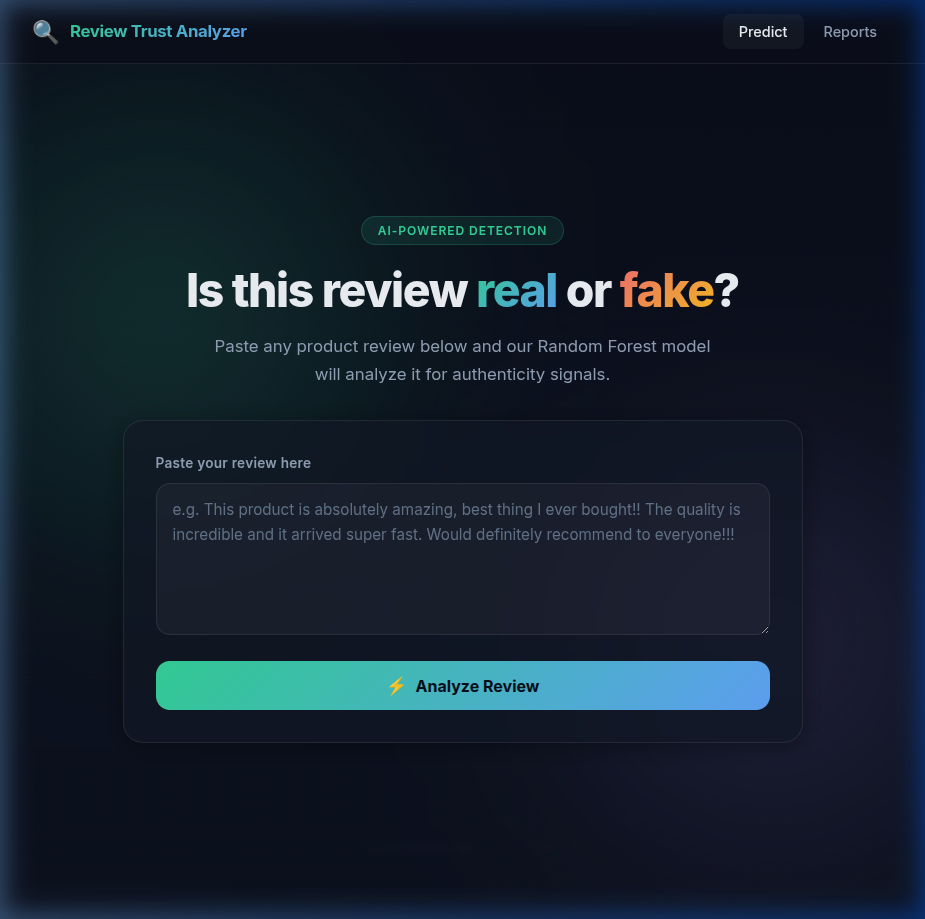
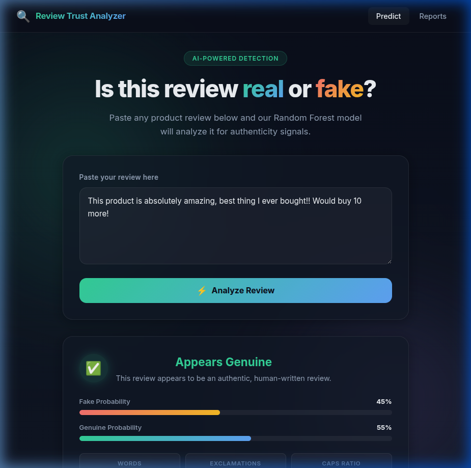
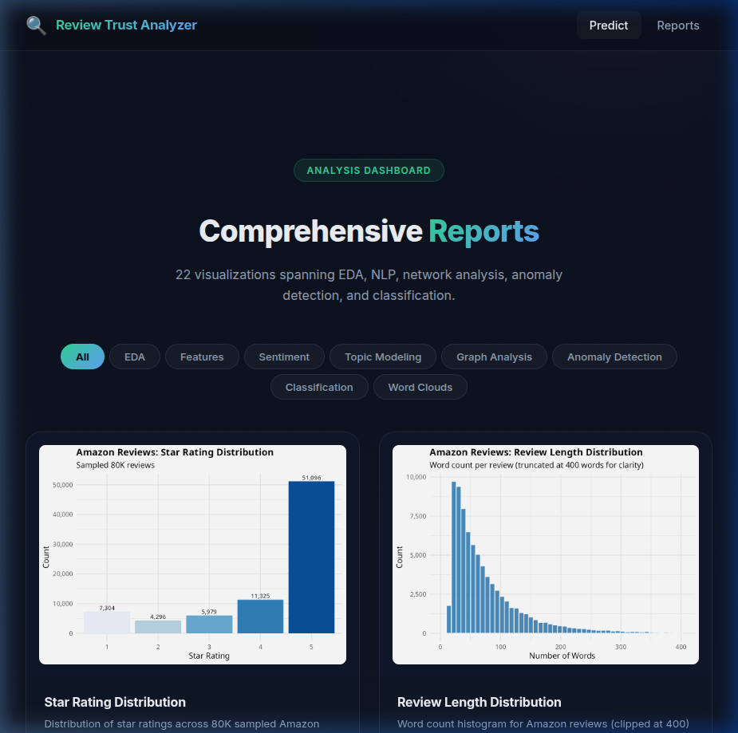
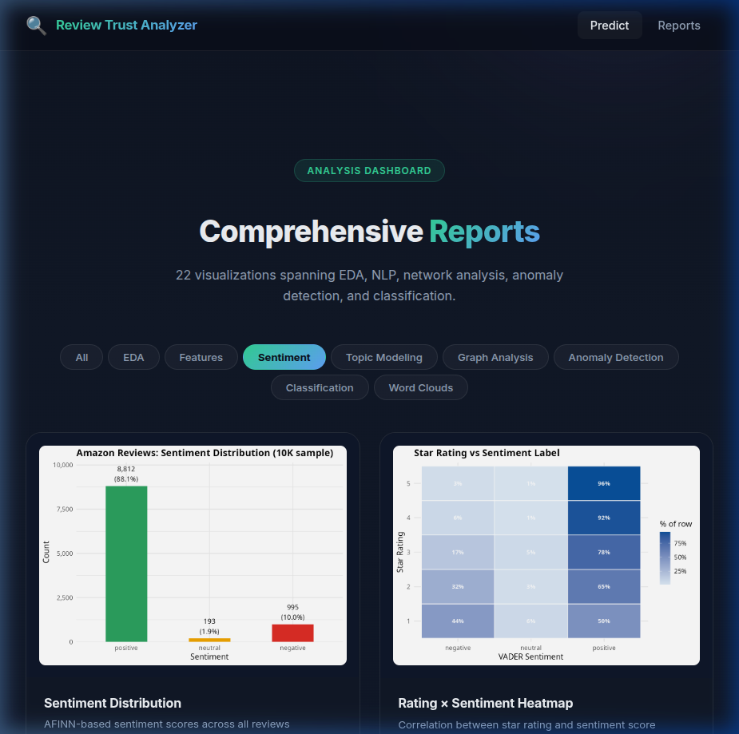
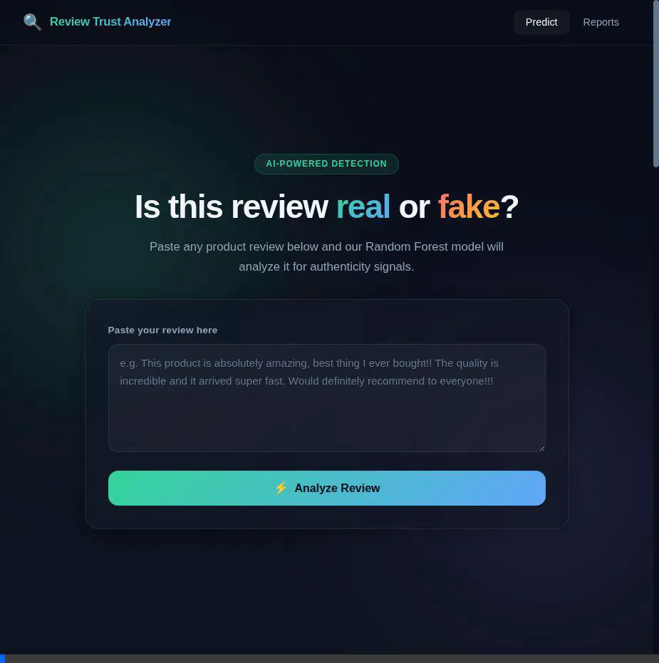

<div align="center">

# 🔍 Review Trust Analyzer

### AI-Powered Fake Review Detection System

*CSS-321 Data Warehousing & Mining Project — Group 1*

[](https://www.r-project.org/)
[](https://en.wikipedia.org/wiki/Random_forest)
[](https://github.com/cjhutto/vaderSentiment)
[](https://en.wikipedia.org/wiki/Latent_Dirichlet_allocation)

---

</div>

## 📌 Overview

**Review Trust Analyzer** is an end-to-end machine learning pipeline that detects fake (computer-generated) product reviews using a combination of NLP, network analysis, and ensemble classification. The system processes raw Amazon and fake review datasets through 9 analytical stages, trains 3 classifiers, and provides a sleek web-based prediction interface.

<div align="center">

| Component | Detail |
|-----------|--------|
| **Datasets** | Amazon Fine Food Reviews (80K sampled) + Fake Reviews Dataset (40K) |
| **Best Model** | Random Forest (200 trees, TF-IDF + dense features) |
| **Features** | TF-IDF (top 5000 terms), handcrafted, VADER sentiment, graph-based |
| **Pipeline** | 9 sequential R scripts |
| **Frontend** | Single-page HTML/CSS/JS |
| **API** | R Plumber (REST) |

</div>

---

## 📸 Screenshots & Demo

### Prediction Interface

Users paste any review text, and the model outputs a Fake/Genuine verdict with confidence probabilities and feature breakdown.

<div align="center">

<br><em>Main page — Input any review for instant analysis</em>
</div>

<br>

<div align="center">

<br><em>Prediction result with probability bars and feature stats</em>
</div>

### Reports Dashboard

All 22 analysis visualizations organized by category with interactive filter tabs and a lightbox viewer.

<div align="center">

<br><em>Reports dashboard with all visualizations</em>
</div>

<br>

<div align="center">

<br><em>Filter tabs to view specific analysis categories</em>
</div>

### Demo Video

<div align="center">

<br><em>Full walkthrough — prediction + reports browsing</em>
</div>

---

## 🏗️ Project Architecture

```
review-trust-analyzer/
├── 01_eda.R                  # Stage 1: Data loading & exploratory analysis
├── 02_preprocess.R           # Stage 2: Text preprocessing & tokenization
├── 03_features.R             # Stage 3: TF-IDF + handcrafted feature extraction
├── 04_sentiment.R            # Stage 4: VADER sentiment analysis
├── 05_topic_modeling.R       # Stage 5: LDA topic modeling (8 topics)
├── 06_graph_analysis.R       # Stage 6: Reviewer behavioral graph analysis
├── 07_anomaly_detection.R    # Stage 7: Isolation Forest anomaly detection
├── 08_classification.R       # Stage 8: Train & compare 3 classifiers
├── 09_wordcloud.R            # Stage 9: Word cloud generation
├── predict.R                 # Standalone prediction script
├── api.R                     # Plumber REST API for predictions
├── dataset/                  # Raw CSVs + intermediate .rds files
│   ├── amazon_reviews.csv
│   ├── fake_reviews.csv
│   └── *.rds                 # Pipeline intermediate outputs
├── trained_models/           # Serialized trained models
│   ├── random_forest.rds
│   ├── logistic_regression.rds
│   ├── naive_bayes.rds
│   └── isolation_forest.rds
├── figures/                  # All 22 generated visualizations
│   ├── eda_01 → eda_05       # Exploratory Data Analysis
│   ├── fig05 → fig06         # Feature Engineering
│   ├── fig07 → fig09         # Sentiment Analysis
│   ├── fig10 → fig11         # Topic Modeling
│   ├── fig12 → fig14         # Graph Analysis
│   ├── fig15 → fig16         # Anomaly Detection
│   ├── fig17 → fig19         # Classification
│   └── fig20 → fig21         # Word Clouds
└── frontend/                 # Web interface
    ├── index.html
    ├── style.css
    └── script.js
```

---

## ⚙️ Pipeline — 9 Stages

### Stage 1 — Exploratory Data Analysis (`01_eda.R`)
- Loads Amazon Fine Food Reviews (568K → 80K sampled) and Fake Reviews (40K)
- Standardizes columns, computes review length, checks class balance
- **Outputs:** 5 EDA figures (rating distribution, review length, class balance, verified status, length by label)

### Stage 2 — Text Preprocessing (`02_preprocess.R`)
- Lowercasing → URL/punctuation removal → tokenization → stopword removal → stemming
- Builds a reusable `clean_text()` function applied to both datasets
- **Outputs:** Cleaned `clean_text` column for all reviews

### Stage 3 — Feature Engineering (`03_features.R`)
- **TF-IDF matrix:** Top 5,000 terms from the fake reviews dataset
- **Handcrafted features:** `review_length`, `exclaim_count`, `caps_ratio`, `avg_word_len`
- **Outputs:** 2 figures (length distribution, exclamation count by label)

### Stage 4 — Sentiment Analysis (`04_sentiment.R`)
- VADER sentiment scoring on full fake dataset (40K) + Amazon sample (10K)
- Rating-sentiment mismatch feature (5★ + negative sentiment → suspicious)
- **Outputs:** 3 figures (sentiment distribution, rating×sentiment heatmap, sentiment by label)

### Stage 5 — Topic Modeling (`05_topic_modeling.R`)
- LDA with 8 topics, Gibbs sampling (500 iterations)
- Topics: Product Quality, Food & Taste, Packaging, Value, Health, Customer Experience, Pet Food, Coffee
- **Outputs:** 2 figures (top terms per topic, topic distribution)

### Stage 6 — Graph Analysis (`06_graph_analysis.R`)
- Per-reviewer features: 5-star ratio, review velocity, burst score
- Detecting co-review clusters (same product within 48 hours)
- Builds a reviewer-reviewer graph, flags suspicious clusters
- **Outputs:** 3 figures (5-star ratio, review velocity, reviewer graph)

### Stage 7 — Anomaly Detection (`07_anomaly_detection.R`)
- Product-level aggregation: review count, rating variance, sentiment std
- Isolation Forest (100 trees) → top 10% flagged as anomalous
- **Outputs:** 2 figures (anomaly scatter, score distribution)

### Stage 8 — Classification (`08_classification.R`)
- Trains 3 models: **Naive Bayes**, **Logistic Regression**, **Random Forest**
- Feature matrix: TF-IDF top 100 terms + 6 dense features = 106 features
- 80/20 stratified train/test split
- **Outputs:** 3 figures (confusion matrix, feature importance, model comparison)

### Stage 9 — Word Clouds (`09_wordcloud.R`)
- Generates word clouds for fake and genuine reviews
- **Outputs:** 2 figures (fake word cloud, genuine word cloud)

---

## 🧪 Key Visualizations

<div align="center">

| Analysis | Preview |
|----------|---------|
| **Confusion Matrix** |  |
| **Feature Importance** |  |
| **Model Comparison** |  |
| **Anomaly Detection** |  |
| **Sentiment Heatmap** |  |
| **LDA Topics** |  |

</div>

---

## 🚀 Getting Started

### Prerequisites

```bash
# R 4.3+ with these packages:
install.packages(c(
  "tidyverse", "tidytext", "SnowballC", "scales", "lubridate",
  "vader", "topicmodels", "igraph", "isotree", "slam",
  "caret", "randomForest", "e1071", "Matrix",
  "wordcloud", "wordcloud2", "RColorBrewer",
  "plumber"
))
```

### Datasets

1. [Amazon Fine Food Reviews](https://www.kaggle.com/datasets/snap/amazon-fine-food-reviews) → save as `dataset/amazon_reviews.csv`
2. [Fake Reviews Dataset](https://www.kaggle.com/datasets/mexwell/fake-reviews-dataset) → save as `dataset/fake_reviews.csv`

### Run the Pipeline

```bash
# Run all 9 stages sequentially
Rscript 01_eda.R
Rscript 02_preprocess.R
Rscript 03_features.R
Rscript 04_sentiment.R
Rscript 05_topic_modeling.R
Rscript 06_graph_analysis.R
Rscript 07_anomaly_detection.R
Rscript 08_classification.R
Rscript 09_wordcloud.R
```

### Use the Prediction API

```bash
# Start the Plumber API
Rscript -e "plumber::plumb('api.R')\$run(port=8787, host='0.0.0.0')"

# Test with curl
curl -X POST http://localhost:8787/predict \
  -H "Content-Type: application/json" \
  -d '{"review_text": "This product is absolutely amazing!!"}'
```

### Open the Frontend

Simply open `frontend/index.html` in your browser. The prediction works even without the API (uses a heuristic fallback), but for real model predictions, start the Plumber API first.

---

## 🛠️ Tech Stack

| Layer | Technology |
|-------|-----------|
| **Language** | R 4.3+ |
| **NLP** | tidytext, SnowballC, TF-IDF |
| **Sentiment** | VADER (vader package) |
| **Topic Modeling** | LDA (topicmodels package, Gibbs sampling) |
| **Graph Analysis** | igraph (network clustering) |
| **Anomaly Detection** | Isolation Forest (isotree package) |
| **Classification** | Random Forest, Logistic Regression, Naive Bayes |
| **API** | Plumber (REST) |
| **Frontend** | HTML5, CSS3, Vanilla JavaScript |
| **Visualization** | ggplot2, wordcloud |

---

## 📂 Outputs Summary

| Category | Count | Figures |
|----------|-------|---------|
| EDA | 5 | `eda_01` → `eda_05` |
| Feature Engineering | 2 | `fig05`, `fig06` |
| Sentiment Analysis | 3 | `fig07` → `fig09` |
| Topic Modeling | 2 | `fig10`, `fig11` |
| Graph Analysis | 3 | `fig12` → `fig14` |
| Anomaly Detection | 2 | `fig15`, `fig16` |
| Classification | 3 | `fig17` → `fig19` |
| Word Clouds | 2 | `fig20`, `fig21` |
| **Total** | **22** | |

---

## 👥 Team

**Group 1** — CSS-321 Data Warehousing & Mining, IIITK

| Member |
|--------|
| Aswin M |
| Divon John |
| Mahadev P Nair |
| Zewin Jos |

---

<div align="center">
<sub>Built with ❤️ using R and data mining techniques</sub>
</div>
